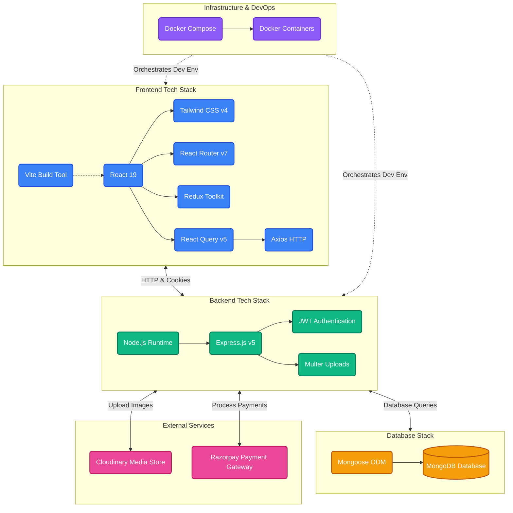
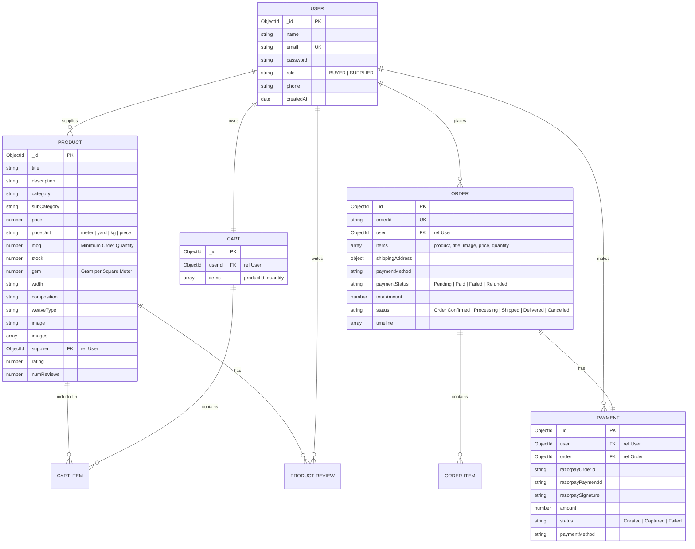

# TexMarket - B2B Textile Marketplace

TexMarket is a specialized B2B and B2C textile marketplace platform designed for buyers and suppliers. It facilitates transactions of fabrics and textile materials, featuring custom specifications like GSM, composition, and weave type, alongside custom seller/buyer profiles, automated PAN card verification, inquiry handling, payment processing, and an interactive AI Assistant.

---

## 🛠️ Tech Stack

### Frontend (Client)
* **Framework:** React 19 (Vite-powered, offering Fast Hot Module Replacement)
* **Routing:** React Router DOM v7
* **State Management:** Redux Toolkit (`@reduxjs/toolkit` & `react-redux`)
* **Data Fetching & Cache Management:** TanStack React Query v5
* **Styling:** Tailwind CSS v4 (using `@tailwindcss/vite` compiler integration)
* **HTTP Client:** Axios
* **Icons:** Lucide React
* **Payments:** Razorpay Client Integration & simulated Scan & Pay scanner (`qrcode.react`)

### Backend (Server)
* **Runtime Environment:** Node.js
* **Framework:** Express.js (v5.2.x)
* **Database ODM:** Mongoose (MongoDB)
* **Authentication:** JSON Web Tokens (JWT) with secure `HttpOnly` cookie parser
* **File Uploads:** Multer with Cloudinary integration (`multer-storage-cloudinary`)
* **Payment Processing:** Razorpay Node.js SDK
* **Developer Tools & Logging:** Morgan (HTTP request logging), Nodemon (Live reload in development)

### Deployment & Containerization
* **Docker & Docker Compose:** Orchestrated multi-container environment separating the `frontend` and `backend` services.

### 📊 Tech Stack Architecture Diagram


---

## 📂 Folder Structure

```text
MarketPlace/
├── client/                     # Frontend Application (Vite + React)
│   ├── src/
│   │   ├── api/                # Axios configuration and API endpoints integrations
│   │   ├── assets/             # Global static assets (images, icons, etc.)
│   │   ├── components/         # Shared & feature-based React components (AIAssistant, PanCard, navbar, etc.)
│   │   ├── hooks/              # Custom React hooks (e.g., useCart)
│   │   ├── pages/              # Main view/page components (Dashboards, Products, Login, Checkout)
│   │   ├── redux/              # Redux slices (auth, cart, product, etc.) and store configuration
│   │   ├── routes/             # Client routes mapping (AppRoutes.jsx)
│   │   ├── utils/              # Utility configurations (Razorpay loaders)
│   │   ├── App.jsx             # Main app entry layout
│   │   └── main.jsx            # React root mounting file
│   ├── Dockerfile              # Container configuration for client
│   ├── package.json            # Frontend dependencies and dev scripts
│   └── vite.config.js          # Vite configuration
│
├── server/                     # Backend Application (Node.js + Express)
│   ├── config/                 # Cloudinary and MongoDB connection setups
│   ├── controllers/            # Controller logic files (handling requests & responses)
│   ├── middleware/             # Express middlewares (authentication, roles check, file upload)
│   ├── models/                 # Mongoose schemas (User, Product, Cart, Order, Payment)
│   ├── routes/                 # Express API routes (V1 versioned routes)
│   ├── utils/              # Backend utilities (async handlers, token generators)
│   ├── Dockerfile              # Container configuration for server
│   ├── server.js               # Entry point of the Express server
│   └── package.json            # Server dependencies and launch scripts
│
├── docker-compose.yml          # Multicontainer setup file for development
└── README.md                   # Project documentation (this file)
```

---

## 📊 System Architecture & Relationships

### 1. System Flow & Architecture
This diagram outlines the interactions between the client application, backend server, MongoDB database, and external API service providers.

```mermaid
graph TD
    subgraph Client Application (Frontend)
        React[React Client - Port 5173]
        RTK[Redux Toolkit & React Query]
        Speech[Speech Recognition API]
        React <--> RTK
        React -.->|Voice Input| Speech
    end

    subgraph Backend Application (API Server)
        Express[Express.js Server - Port 5000]
        Middle[Auth & Upload Middlewares]
        Routes[API Router /api/v1/*]
        Express --> Middle
        Middle --> Routes
    end

    subgraph Databases & Storages
        MongoDB[(MongoDB Database)]
    end

    subgraph External Services
        Cloudinary[Cloudinary Cloud Storage]
        Razorpay[Razorpay Payment API]
    end

    React <-->|HTTPS API / HttpOnly Cookie| Express
    Routes <-->|Mongoose ODM| MongoDB
    Routes <-->|Upload Media| Cloudinary
    Routes <-->|Process Payments| Razorpay
```

### 2. Entity Relationship Diagram (ERD)
The database schema consists of five primary entities. Below is their relationship model:



---

## 🚀 Getting Started

### Prerequisites
Make sure you have node/npm and Docker installed:
* **Node.js:** v18.x or above
* **npm:** v9.x or above
* **Docker & Docker Compose** (Recommended)

---

### Method A: Setup Using Docker Compose (Recommended)

Running the project via Docker configures client and server containers automatically:

1. Clone or navigate to the project directory.
2. Ensure you have configured the env variables in `/server/.env` (see Environment configuration below).
3. Start the services with Docker:
   ```bash
   docker-compose up --build
   ```
4. Access the applications:
   * **Frontend Application:** `http://localhost:5173`
   * **Backend server:** `http://localhost:5000`

---

### Method B: Manual / Local Setup

If you prefer to run services manually on your host machine:

#### 1. Server Configuration
1. Navigate to the server folder:
   ```bash
   cd server
   ```
2. Install dependencies:
   ```bash
   npm install
   ```
3. Run the development server (runs nodemon):
   ```bash
   npm run dev
   ```
   *The server runs by default on port `5000` (API endpoint: `http://localhost:5000/api/v1`).*

#### 2. Client Configuration
1. Navigate to the client folder in a new terminal:
   ```bash
   cd client
   ```
2. Install dependencies:
   ```bash
   npm install
   ```
3. Run the client development server:
   ```bash
   npm run dev
   ```
   *The frontend compiles and starts on `http://localhost:5173`.*

---

## ⚙️ Environment Configuration

Ensure both client and server folders contain their respective `.env` files.

### Backend Config (`/server/.env`)
Create a `.env` in the `/server` directory:
```env
PORT=5000
MONGODB_URI=mongodb+srv://<username>:<password>@cluster.mongodb.net/marketplace
JWT_SECRET=your_jwt_secret_key_here
CLIENT_URL=http://localhost:5173

# Cloudinary Storage
CLOUDINARY_CLOUD_NAME=your_cloudinary_cloud_name
CLOUDINARY_API_KEY=your_cloudinary_api_key
CLOUDINARY_API_SECRET=your_cloudinary_api_secret

# Razorpay Integration
RAZORPAY_API_KEY=your_razorpay_api_key
RAZORPAY_KEY_SECRET=your_razorpay_key_secret
```

### Frontend Config (`/client/.env`)
Create a `.env` in the `/client` directory:
```env
VITE_API_URL=http://localhost:5000
```
